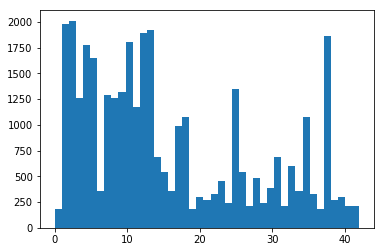
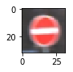
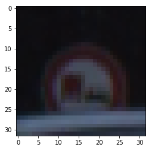
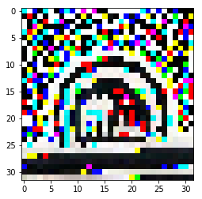
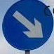
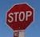
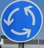
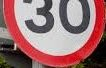

#Traffic Sign Recognition

#Writeup

The goals / steps of this project are the following:

* Load the data set (see below for links to the project data set)
* Explore, summarize and visualize the data set
* Design, train and test a model architecture
* Use the model to make predictions on new images
* Analyze the softmax probabilities of the new images
* Summarize the results with a written report

##Here I will consider the rubric points individually and describe how I addressed each point in my implementation.

###Writeup / README

####1. Provide a Writeup / README that includes all the rubric points and how you addressed each one. You can submit your writeup as markdown or pdf. You can use this template as a guide for writing the report. The submission includes the project code.

You're reading it! and here is a link to my project code

###Data Set Summary & Exploration

####1. Provide a basic summary of the data set and identify where in your code the summary was done. In the code, the analysis should be done using python, numpy and/or pandas methods rather than hardcoding results manually.

The code for this step is contained in the second code cell of the IPython notebook.

I used the numpy capabilities to calculate summary statistics of the traffic signs data set:

* The size of training set is 34799
* The size of test set is 12630
* The shape of a traffic sign image is 32x32x3
* The number of unique classes/labels in the data set is 43

####2. Include an exploratory visualization of the dataset and identify where the code is in your code file.

The code for this step is contained in the third code cell of the IPython notebook.

Here is an exploratory visualization of the data set. It is a bar chart showing how the data is distributed.

X axis represents the types of traffic signs. Y axis represents the number of occurrences of a particular type.

Below is a random traffic sign from the dataset.

According to the labels provided with the training data, the sign is of type 17 'No entry'.

###Design and Test a Model Architecture

####1. Describe how, and identify where in your code, you preprocessed the image data. What tecniques were chosen and why did you choose these techniques? Consider including images showing the output of each preprocessing technique. Pre-processing refers to techniques such as converting to grayscale, normalization, etc.

The code for this step is contained in the fourth code cell of the IPython notebook.

I tried several ways to preprocess images including converting to gray scale, converting to Luv color space, and enhancing image contrast. However, none of these method gave improvement in image classification.

Finally, I decided to use gradient of the image because gradient shows how neighbor pixels are different. This should be really useful because traffic signs have sharp borders and distinct shapes within. All the following training and recognition is done based on image gradients.

Here is an example of a traffic sign image before and after preprocessing.

Sign 10 'No passing for vehicles over 3.5 metric tons'.

####2. Describe how, and identify where in your code, you set up training, validation and testing data. How much data was in each set? Explain what techniques were used to split the data into these sets. (OPTIONAL: As described in the "Stand Out Suggestions" part of the rubric, if you generated additional data for training, describe why you decided to generate additional data, how you generated the data, identify where in your code, and provide example images of the additional data)

The code for splitting the data into training and validation sets is contained in the first code cell of the IPython notebook.

####3. Describe, and identify where in your code, what your final model architecture looks like including model type, layers, layer sizes, connectivity, etc.) Consider including a diagram and/or table describing the final model.

The code for my final model is located in the fifth cell of the IPython notebook.

My final model consisted of the following layers:

| Layer           | Description                                 |
|:---------------:|:-------------------------------------------:|
| Input           | 32x32x3 RGB image                           |
| Convolution 5x5 | 1x1 stride, valid padding, outputs 28x28x6  |
| tanh            |                                             |
| Average Pooling | Stride 2x2, outputs 14x14x6                 |
| Dropout         | Training keeping probability 0.5            |
| Convolution 5x5 | 1x1 stride, valid padding, outputs 10x10x16 |
| RELU            |                                             |
| Max Pooling     | Stride 2x2, outputs 5x5x16                  |
| Flattening      | Outputs 400                                 |
| Fully Connected | Mean=0, stddev=0.1, outputs 120             |
| RELU            |                                             |
| Fully Connected | Mean=0, stddev=0.1, outputs 84              |
| tanh            |                                             |
| Fully Connected | Mean=0, stddev=0.1, outputs 43              |
| Softmax         | One hot out of 43                           |

####4. Describe how, and identify where in your code, you trained your model. The discussion can include the type of optimizer, the batch size, number of epochs and any hyperparameters such as learning rate.

The code for training the model is located in the eighth cell of the IPython notebook.

To train the model, I used tf.train.AdamOptimizer. The batch size was set to 8192 to speed up the training. The learning rate was set to classical 0.001.

As for the number of epochs, using dropout in one of the layers made learning much slower. Thus it took a lot of epoch to train the network. I trained the network with several number of epochs with the step of 50 until I reached 500 epochs, after that I also trained it with 1000 epochs. My observation is that validation accuracy stopped improving after about 400 epochs.

####5. Describe the approach taken for finding a solution. Include in the discussion the results on the training, validation and test sets and where in the code these were calculated. Your approach may have been an iterative process, in which case, outline the steps you took to get to the final solution and why you chose those steps. Perhaps your solution involved an already well known implementation or architecture. In this case, discuss why you think the architecture is suitable for the current problem.

The code for calculating the accuracy of the model is located in the seventh, eighth, and ninth cells of the IPython notebook.

My final model results were:

* validation set accuracy of 0.976
* test set accuracy of 0.96

If an iterative approach was chosen:

I started with LeNet architecture because it was recommended by the lecturer as a good starting point.

The initial validation set accuracy was quite low, 80+ percent. In order to improve it, I started experimenting with different activation functions (tanh, relu, sigmoid, and their combinations) and convolution layers' parameters. This raised the accuracy to about 92%.

The next action that substantially improved the accuracy was not the network architecture but input image manipulation. Instead of using the original image, I switched to training the model with image gradients (mentioned in the section about preprocessing). This brought the accuracy to 98-99%.

At this point, overfitting became a distinct issue so I inserted a dropout stage into the network. At first, the accuracy dropped sharply to the level of 10-20% but with a vast increase in number of epochs the accuracy returned to more than 97%.

###Test a Model on New Images

####1. Choose five German traffic signs found on the web and provide them in the report. For each image, discuss what quality or qualities might be difficult to classify.

Here are five German traffic signs that I found on the web:

The first and last images might be difficult to classify because the first one has an obstacle before it and the last one is present only partly including the number of speed limit itself. The third image has a perspective from below and some additional objects in vision.

####2. Discuss the model's predictions on these new traffic signs and compare the results to predicting on the test set. Identify where in your code predictions were made. At a minimum, discuss what the predictions were, the accuracy on these new predictions, and compare the accuracy to the accuracy on the test set (OPTIONAL: Discuss the results in more detail as described in the "Stand Out Suggestions" part of the rubric).

The code for making predictions on my final model is located in the tenth cell of the IPython notebook.

Here are the results of the prediction:

| Image                | Prediction           |
|:--------------------:|:--------------------:|
| Keep Left            | Keep Left            |
| Keep Right           | Keep Right           |
| Stop                 | Stop                 |
| Roundabout mandatory | Roundabout mandatory |
| Speed limit (30km/h) | Speed limit (50km/h) |

The model was able to correctly guess 4 of the 5 traffic signs, which gives an accuracy of 80%. Trying with 8 (not covered in this writeup) images gave 7 out of 8 - 87.5% This compares favorably to the accuracy on the test set of 96%.

####3. Describe how certain the model is when predicting on each of the five new images by looking at the softmax probabilities for each prediction and identify where in your code softmax probabilities were outputted. Provide the top 5 softmax probabilities for each image along with the sign type of each probability. (OPTIONAL: as described in the "Stand Out Suggestions" part of the rubric, visualizations can also be provided such as bar charts)

The code for making predictions on my final model is located in the tenth, eleventh, and twelfth cells of the IPython notebook.

For the first image, the model correctly predicted that this is a keep left sign, however, the probability is lowish: 0.395. This can be explained by the obstacle in front of the sign. The top five soft max probabilities are:

| Probability                | Prediction           |
|:--------------------:|:--------------------:|
| 0.395            | Keep Left            |
| Keep Right           | Keep Right           |
| Stop                 | Stop                 |
| Roundabout mandatory | Roundabout mandatory |
| Speed limit (30km/h) | Speed limit (50km/h) |

For the second image, the model is completely sure that this is a keep right sign (probability of 0.9998), and the image does contain a keep right sign. The other four soft max probabilities are negligible.

For the third image, the model is sure that this is a stop sign (probability 0.718), and the image does contain a stop sign. The top five soft max probabilities are:

| Probability                | Prediction           |
|:--------------------:|:--------------------:|
| 0.718            | Stop            |
| Keep Right           | Keep Right           |
| Stop                 | Stop                 |
| Roundabout mandatory | Roundabout mandatory |
| Speed limit (30km/h) | Speed limit (50km/h) |

For the fourth image, the model is completely sure that this is a roundabout sign (probability 0.971), and the image does contain a roundabout sign. The top five soft max probabilities are:

| Probability                | Prediction           |
|:--------------------:|:--------------------:|
| 0.971            | Roundabout            |
| Keep Right           | Keep Right           |
| Stop                 | Stop                 |
| Roundabout mandatory | Roundabout mandatory |
| Speed limit (30km/h) | Speed limit (50km/h) |

For the fifth image, the model is somewhat sure that this is a speed limit (50 km/h) sign, (probability 0.432). Although the image does contain a speed limit sign, the actual limit 30 km/h hence the network misclassified the image. The number on the sign is partially hidden. The top five soft max probabilities are:

| Probability                | Prediction           |
|:--------------------:|:--------------------:|
| 0.432            | Speed Limit (50 km/h)            |
| Keep Right           | Keep Right           |
| Stop                 | Stop                 |
| Roundabout mandatory | Roundabout mandatory |
| Speed limit (30km/h) | Speed limit (50km/h) |

